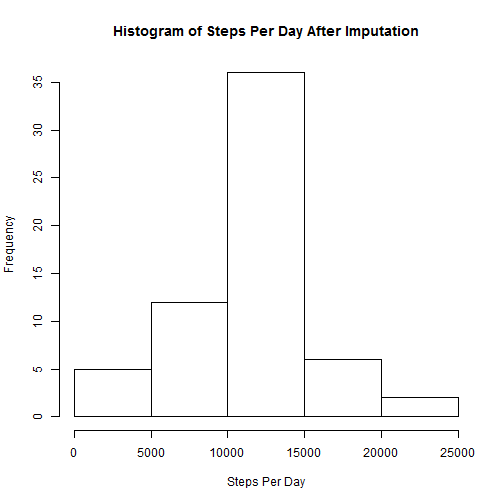

 # Reproducible Research: Peer Assessment 1
 
 ##Loading and preprocessing the data
  
 * Input file is a csv file which is loaded as - 
 


```r
activity <- read.csv(file = "activity.csv", stringsAsFactors = FALSE)
```
 -----
 
  ##What is mean total number of steps taken per day?
  
  ###1. Calculate the total number of steps taken per day

```r
stepsPerDay <- tapply(activity$steps, activity$date, sum, na.rm=TRUE)
```
 
  ###2. Histogram of the total number of steps taken each day


```r
hist(stepsPerDay, main = "Histogram of Steps Per Day", xlab = "Steps Per Day")
```


 ###3. Calculate and report the mean and median of the total number of steps taken per day
 

```r
meanStepsPerDay <- mean(stepsPerDay)
medianStepsPerDay <- median(stepsPerDay)
```
 
 Mean Steps per Day : 9354
 Median Steps per Day : 10395
 
 -----
 
 ##What is the average daily activity pattern?


```r
avgStepsPerInterval <- aggregate(activity$steps, list(activity$interval), mean, na.rm=TRUE)
```
 
  ###1. Make a time series plot
 
 

```r
plot(avgStepsPerInterval$Group.1,avgStepsPerInterval$x , type ="l", xlab = "Interval" , ylab = "Average Steps Per Interval")
```


 ###2. Which 5-minute interval, contains the maximum number of steps?
 

```r
max_interval <- max(avgStepsPerInterval$x)
Max_time_of_day <- avgStepsPerInterval[avgStepsPerInterval$x == max_interval,"Group.1"]/100
```
 
 Interval with maximum steps: 8.35
 
 -----
 
 ##Imputing missing values
 
 ###1. Calculate and report the total number of missing values in the dataset
 

```r
sum(is.na(activity$steps))
```

```
## [1] 2304
```
 
 Missing values: 2304
 
 ###2. Strategy for filling in all of the missing values in the dataset
 

```r
imputeSteps <- function(steps, interval) {
     imputevalue <- NA
     if (!is.na(steps))
         imputevalue <- steps
     else
         imputevalue <- (avgStepsPerInterval[avgStepsPerInterval$Group.1==interval, "x"])
     return(imputevalue)
 }
```
 
 Missing values are imputed with average value of steps in a particular interval
 
 ### 3. Create a new dataset that is equal to the original dataset but with the missing data filled in
 
 

```r
activityImputed <- activity
activityImputed$steps <- mapply(imputeSteps, activityImputed$steps, activityImputed$interval)
stepsPerDayImputed <- tapply(activityImputed$steps, activityImputed$date, sum)
```
 

 ### 4. Make a histogram of the total number of steps taken each day and Calculate and report the mean and median total number of steps 


```r
hist(stepsPerDayImputed, main = "Histogram of Steps Per Day After Imputation", xlab = "Steps Per Day")
```




```r
meanStepsPerDayImputed <- mean(stepsPerDayImputed)
medianStepsPerDayImputed <- median(stepsPerDayImputed)
```
 
Mean Steps Per Day After Imputation : 10766
Median Steps Per Day After Imputation : 10766

 -----
 
 ##Differences in activity patterns between weekdays and weekends?
 
 ###1. Create a new factor variable in the dataset with two levels - "weekday" and "weekend"
 
 

```r
identifyWeekday <- function(date) {
 dayofWeek <- weekdays(strptime(date,"%Y-%m-%d"))
  if (dayofWeek %in% c("Monday", "Tuesday", "Wednesday", "Thursday", "Friday")) 
    return("weekday") else  (dayofWeek %in% c("Saturday", "Sunday")) 
  return("weekend")
  }

activityImputed$day1 <- sapply(activityImputed$date, FUN = identifyWeekday)
meanSummary <- aggregate(steps ~ interval + day1, data = activityImputed, mean)
```
 
 ### 2. Make a panel plot containing a time series plot 
 

```r
library(lattice)
xyplot(meanSummary$steps ~ meanSummary$interval|meanSummary$day, main="Average Steps per Day by Interval",xlab="Interval", ylab="Steps",layout=c(1,2), type="l")
```


